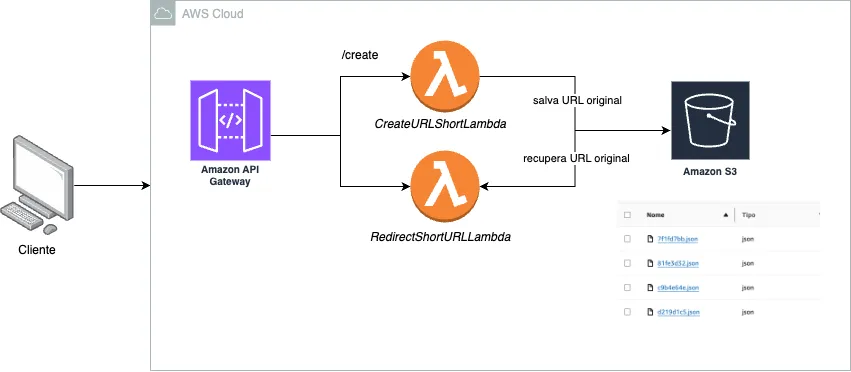

# Java na Prática com AWS 

## Curso Java - AWS Lambda

Descrição retirada do Notion feito pela [@Fernanda-Kipper](https://github.com/Fernanda-Kipper) e [@Rocketseat](https://github.com/rocketseat-education/)

### Projeto

O projeto trata-se de um **sistema de encurtamento de URLs** utilizando a AWS como infraestrutura
serverless. O objetivo é permitir que os usuários criem URLs curtas que redirecionem para URLs
originais, com um tempo de expiração configurável. O sistema é composto por duas funções
Lambda: a primeira função é responsável por **gerar e armazenar** os links encurtados em um bucket
S3, junto com informações como a URL original e o tempo de expiração; a segunda função **gerencia
o redirecionamento**, verificando o código da URL curta e validando se a URL ainda está dentro do
prazo de expiração antes de redirecionar o usuário.

## Repositórios originais do projeto e curso 

[Repositório da Aula 01 e 02](https://github.com/rocketseat-education/curso-java-aws-lambda-generate-shortner-url)

[Repositório da Aula 03](https://github.com/rocketseat-education/curso-java-aws-lambda-generate-shortner-url)

## Notion

## [ Guia do curso gratuito de Java](https://efficient-sloth-d85.notion.site/Guia-do-curso-gratuito-de-Java-d19bee9b1e3049038f6cf828334821a6)

## [Curso Java - AWS Lambda](https://efficient-sloth-d85.notion.site/Curso-Java-AWS-Lambda-725cedf305da44c69c847db4e3bad657)

## [ Java na Prática by AWS](https://metal-flea-041.notion.site/Java-na-Pr-tica-by-AWS-1172014141ff8022a3e4ee81c99c2e57)

## Tecnologias utilizadas

